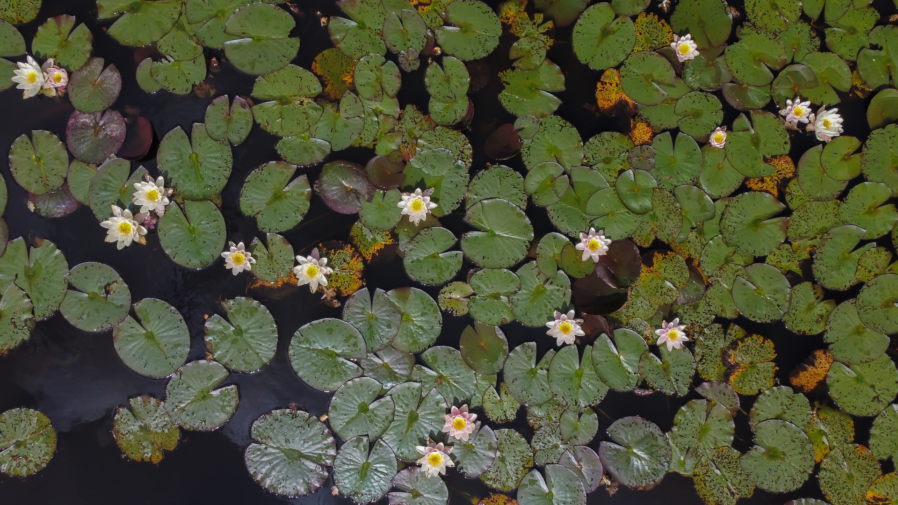

# Reflective Report on Interactive Art Animation

## Project Overview
My journey into the field of coding began out of curiosity. As an undergraduate student majoring in Public Relations and trying this field for the first time, coding seemed like an insurmountable challenge—a world full of complex syntax and logic. However, I was determined to learn. Although the process was very tough and I encountered many difficulties, the final presentation may not be as beautiful as other artistic works, but I made great efforts to learn and try.

## Group Project: Initial Challenges and Attempts
At the beginning of our group project, we faced many challenges. The task of simulating and animating an artwork using p5.js was daunting. Our team spent countless hours brainstorming, trying different techniques, and solving various issues. Each attempt brought new insights but also new obstacles, from understanding the complexities of p5.js to synchronizing our individual contributions into a cohesive final product.

## Choosing Pacita Abad's "Wheels of Fortune"
After many discussions, we decided to base our project on Pacita Abad's "Wheels of Fortune." 

.jpg)

This artwork, with its vibrant colors and dynamic patterns, presented both a challenge and an opportunity to enhance our coding skills. The abstract nature of Abad's work allowed us to explore creative coding techniques to simulate the inherent visual complexity and sense of motion in the piece.

## Individual Task: User Input
For my individual task, I chose to animate our group code using user input (specifically through mouse and keyboard interactions). This decision stemmed from my desire to make the artwork more engaging and interactive. I envisioned an experience where users could influence the animation, making each interaction unique and personalized. The ability to control elements of the artwork through simple inputs added a layer of depth and immersion, transforming viewers from passive observers to active participants.

## Inspiration and Development Process
Pacita Abad's "Wheels of Fortune" is an abstract artwork composed of various circles, resembling flowers to me. This inspired the idea of flowers in a pond, where ripples would form when stones are thrown in, causing the flowers to sway. 

Initially, I modified the base code to create a ripple effect when the user clicked on the screen. Later, I was inspired by the interactive installation "Wallwave Vibrations" by Loris Cecchini. This installation uses projection technology to display dynamic ripple patterns on walls, allowing viewers to interact with the ripples through sensors, touch screens, or cameras. 

[Link website](https://mymodernmet.com/loris-cecchini-wallwave-vibrations-extruding-bodies-sculptures)

This interactive art inspired me to use Perlin noise to transform the original boring ripples into electromagnetic waves, which would push the circular groups. When pushed, these groups would become agitated, continuously changing colors until they are pushed off the screen.

## Interaction Instructions

1. **Create New Groups**: Click and drag the left mouse button to create new groups at the dragged position. I tried to make these groups resemble blooming flowers.
2. **Create Ripples**: Double-click anywhere on the canvas to create ripples.
3. **Double-Click**: Double-click anywhere on the canvas to create a ripple effect from the clicked point.
4. **Increase Ripple Speed**: Click the "Increase Ripple Speed" button in the top left corner to speed up the ripple expansion.
5. **Reset Ripples**: Click the "Reset Ripples" button in the top left corner to clear the current ripples.
6. **Reset Canvas**: Press the space bar to reset the entire canvas.

Users can add groups to the screen and create ripples. As the ripples push the groups outward, the groups will continuously change colors.

## Technical Explanation
### How the Animation Code Works
My code animates the image through user input (mouse and keyboard). Here are some key aspects of the technical implementation:

1. **Animating Properties**:
   - **Color Change**: The primary animated property in my code is the color of the circle groups. When the ripple effect interacts with the circle groups, their colors change continuously, creating a dynamic visual effect. This is achieved by generating new random colors for each group when they are influenced by the ripples.
   - **Movement**: Another animated property is the movement of the circle groups. The ripple effect pushes the circle groups outward from the center of the ripple. This movement is calculated using vectors to determine the direction and force applied to each group.

2. **Creating and Managing Circle Groups**:
   - The `createNonOverlappingCircle` function generates non-overlapping circle groups. Each group consists of a large circle and multiple smaller circles.
   - The `Circle` class defines the properties and methods of the circle groups, including display, update, and response to ripple effects.

3. **Ripple Effect**:
   - The `doubleClicked` function sets the center of the ripples and resets the ripple diameter and speed.
   - The `draw` function calculates the expansion of the ripples, using Perlin noise to add smoothness and natural variation to the ripple edges.
   - The colors and transparency of the ripples change with distance from the center, making the ripples gradually disappear.
   - As the ripples expand, the distance between each circle group and the ripple center is calculated. If the distance is less than the current ripple radius, the circle group is considered affected by the ripple.

4. **Ripple Expansion and Influence**:
   - Ripples start expanding from the double-click position with an initial diameter of 0, and the speed gradually slows down.
   - Perlin noise is used to create natural undulations along the ripple edges, enhancing the realism of the ripples.
   - The color and transparency of the ripples are mapped based on their distance from the center, making the ripples appear to fade out.
   - When ripples reach a certain distance, if the center of a circle group is within the ripple radius, the group is affected by the ripple's force.

5. **Response of Circle Groups**:
   - Each circle group checks in its `update` method whether it is intersected by the ripples. If the distance between the group's center and the ripple center is less than the ripple radius, the group experiences a push force.
   - This push force is determined by calculating the directional vector from the ripple center to the group's center. The vector is normalized and scaled, serving as the movement speed for the group.
   - The circle groups also change color when affected by the ripples, adding to the dynamic visual effect.

6. **User Interaction**:
   - Users can generate new circle groups by dragging the mouse (`mouseDragged` function).
   - Users can create ripple effects by double-clicking (`doubleClicked` function).
   - The ripple speed can be increased by clicking a button (`increaseRippleSpeed` function).
   - Ripples and the canvas can be reset using buttons and the space bar (`resetRipple` and `keyPressed` functions).

###  Technologies and Tools
In my project, I used the following technologies and tools:

1. **p5.js**:
   - p5.js is a JavaScript library for creating graphics and interactive experiences. I used p5.js to implement all the animations and interactions.
   - Reference: [p5.js Documentation](https://p5js.org/reference/)

2. **Perlin Noise**:
   - To make the ripple effect more natural and smooth, I used Perlin noise. Perlin noise is a type of gradient noise commonly used to generate natural textures and motions. Using Perlin noise allows the edges of the ripples to be smoother, avoiding the harsh effects of traditional noise generation.
   - Reference: [Perlin Noise Example](https://p5js.org/examples/math-noise-wave.html)

3. **Event Listeners**:
   - I used event listeners to handle user inputs, such as mouse dragging, double-clicking, and key presses. Event listeners trigger the corresponding functions in real-time, enabling responsive interactions with the canvas.
   - Reference: [MDN Event Listener Documentation](https://developer.mozilla.org/en-US/docs/Web/API/EventTarget/addEventListener)

